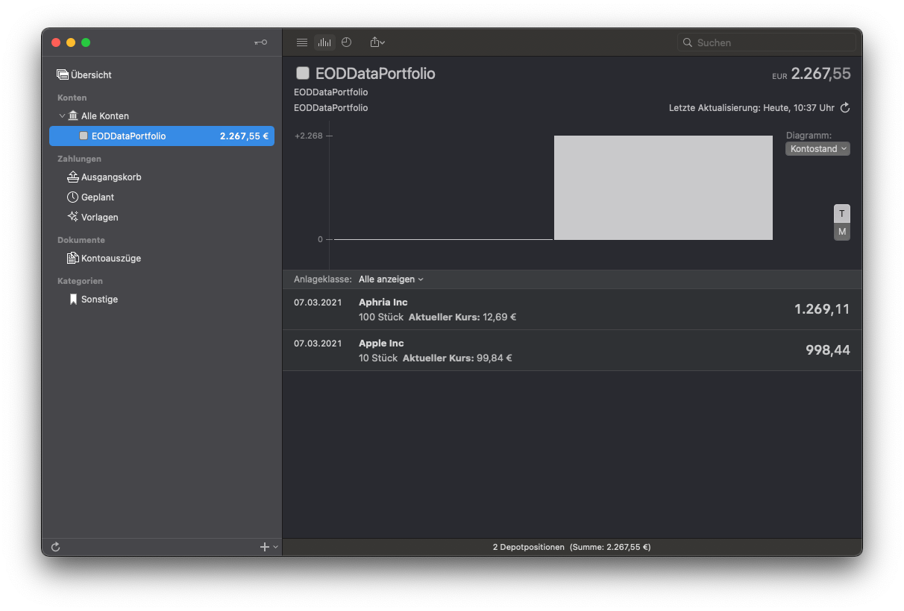

# EODDataPortfolio-MoneyMoney
Inofficial EODData  Extension for MoneyMoney

## Setup

1. Download the extension via the [GitHub releases page](https://github.com/conradreisch/EODDataPortfolio-MoneyMoney/releases/tag/v1.1)
2. Once downloaded, move `EODDataPortfolio.lua` to your MoneyMoney Extensions folder.
3. Add a new account with the type `EODDataPortfolio`
4. Include your stock portfolio in MoneyMoney by providing the stock symbols, the number of shares and the currency as username. Example: `NASDAQ/AAPL(10)[USD],TSX/APHA(100)[CAD]`
5. Type in anthing as password (no password required)

### Bonus
Add the buying rates in MoneyMoney via right click on the stock to display the profits.

### Requirements
You need at least version 2.4.3 or a beta version of MoneyMoney.
